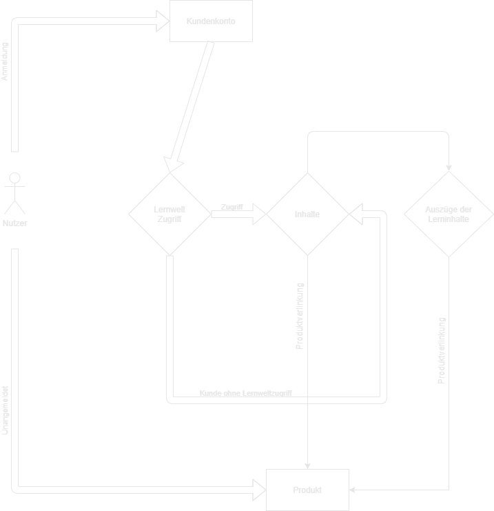

# Lernwelt Plugin SW6
## Datenbank Modell

 

    

## Erläuterung
#### USER Entity

    - Lernwelt User wird erstellt, wenn <a href="">Lernwelt-Code</a> eingegeben wird [Hook bei Eingabe erzeugt User entity]  
    - Eintrag des <a href="">Lernwelt-Code</a> in Datenbank.  
    - <a href="">Lernwelt-Code</a> beinhaltet Informationen (Zugangsdauer, Nutzer Gruppe).  
    - Beifügen von Informationen bei Erstellung des <a href="">Lernwelt-Code</a> (Keine Redundante Daten)  

#### LernweltContent Entity
contentTyp definiert die Art des Inhaltes
Mögliche values:

        -image (Bild)
        -video (Video)
        -audio (Audio)
        -tut (Tutortial) 
        -text (Text)
        -site (Seiten Template)

#### LernweltCategories Entity

- Diese Entität beinhaltet einen Kategorie Namen 
- sowie eine "restrictionGroup" zur steuerung des Zugriffs auf bestimmte Bereiche.
<a href="#/Roadmap#lernwelt-restricted-content">(Funktion für geplantes Feature).</a>

## Nutzer UML

    

